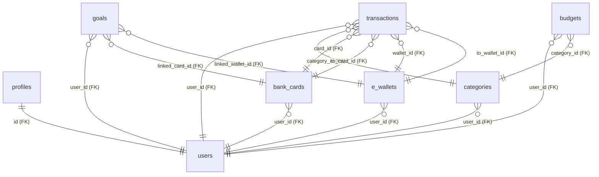

# Database Schema Documentation

This document provides a comprehensive overview of the Supabase project "BudgetTracker" (`twykxdelvpnsogrszcts`) database schema, including tables, columns, and relationships.

## Relationships Diagram

---

## Tables

### 1. `profiles`
Stores additional user profile information linked to Supabase Auth.

| Column | Data Type | PK/FK | Options | Default |
| :--- | :--- | :--- | :--- | :--- |
| `id` | `uuid` | PK, FK (auth.users) | updatable | - |
| `full_name` | `text` | - | nullable, updatable | - |
| `avatar_url` | `text` | - | nullable, updatable | - |
| `created_at` | `timestamptz` | - | updatable | `timezone('utc'::text, now())` |
| `updated_at` | `timestamptz` | - | updatable | `timezone('utc'::text, now())` |

### 2. `bank_cards`
Stores user's bank card information.

| Column | Data Type | PK/FK | Options | Default |
| :--- | :--- | :--- | :--- | :--- |
| `id` | `uuid` | PK | updatable | `gen_random_uuid()` |
| `user_id` | `uuid` | FK (auth.users) | updatable | - |
| `card_name` | `text` | - | updatable | - |
| `card_type` | `text` | - | updatable | - |
| `balance` | `numeric` | - | updatable | `0.00` |
| `color` | `text` | - | nullable, updatable | - |
| `text_color` | `text` | - | nullable, updatable | `'#ffffff'` |
| `last_four` | `text` | - | nullable, updatable | - |
| `is_active` | `boolean` | - | updatable | `true` |
| `created_at` | `timestamptz` | - | updatable | `timezone('utc'::text, now())` |
| `updated_at` | `timestamptz` | - | updatable | `timezone('utc'::text, now())` |

**Constraints:**
- `card_type`: Must be one of `['credit', 'debit', 'savings']`.

### 3. `e_wallets`
Stores user's digital wallet information.

| Column | Data Type | PK/FK | Options | Default |
| :--- | :--- | :--- | :--- | :--- |
| `id` | `uuid` | PK | updatable | `gen_random_uuid()` |
| `user_id` | `uuid` | FK (auth.users) | updatable | - |
| `wallet_name` | `text` | - | updatable | - |
| `wallet_type` | `text` | - | updatable | - |
| `account_identifier` | `text` | - | nullable, updatable | - |
| `balance` | `numeric` | - | updatable | `0.00` |
| `color` | `text` | - | nullable, updatable | - |
| `text_color` | `text` | - | nullable, updatable | `'#ffffff'` |
| `is_active` | `boolean` | - | updatable | `true` |
| `created_at` | `timestamptz` | - | updatable | `timezone('utc'::text, now())` |
| `updated_at` | `timestamptz` | - | updatable | `timezone('utc'::text, now())` |

### 4. `categories`
Stores transaction and budget categories.

| Column | Data Type | PK/FK | Options | Default |
| :--- | :--- | :--- | :--- | :--- |
| `id` | `uuid` | PK | updatable | `gen_random_uuid()` |
| `user_id` | `uuid` | FK (auth.users) | nullable, updatable | - |
| `name` | `text` | - | updatable | - |
| `type` | `text` | - | updatable | - |
| `icon` | `text` | - | nullable, updatable | - |
| `color` | `text` | - | nullable, updatable | - |
| `is_default` | `boolean` | - | updatable | `false` |
| `created_at` | `timestamptz` | - | updatable | `timezone('utc'::text, now())` |

**Constraints:**
- `type`: Must be one of `['income', 'expense']`.

### 5. `transactions`
Stores financial transactions (Income, Expense, Transfer, Withdrawal).

| Column | Data Type | PK/FK | Options | Default |
| :--- | :--- | :--- | :--- | :--- |
| `id` | `uuid` | PK | updatable | `gen_random_uuid()` |
| `user_id` | `uuid` | FK (auth.users) | updatable | - |
| `card_id` | `uuid` | FK (bank_cards) | nullable, updatable | - |
| `wallet_id` | `uuid` | FK (e_wallets) | nullable, updatable | - |
| `category_id` | `uuid` | FK (categories) | nullable, updatable | - |
| `to_card_id` | `uuid` | FK (bank_cards) | nullable, updatable | - |
| `to_wallet_id` | `uuid` | FK (e_wallets) | nullable, updatable | - |
| `type` | `text` | - | updatable | - |
| `payment_method` | `text` | - | updatable | - |
| `amount` | `numeric` | - | updatable | - |
| `description` | `text` | - | nullable, updatable | - |
| `transaction_date` | `date` | - | updatable | `CURRENT_DATE` |
| `receipt_url` | `text` | - | nullable, updatable | - |
| `created_at` | `timestamptz` | - | updatable | `timezone('utc'::text, now())` |
| `updated_at` | `timestamptz` | - | updatable | `timezone('utc'::text, now())` |

**Constraints:**
- `type`: Must be one of `['income', 'expense', 'withdrawal', 'transfer']`.
- `payment_method`: Must be one of `['cash', 'card', 'ewallet']`.

### 6. `budgets`
Stores user-set spending limits per category.

| Column | Data Type | PK/FK | Options | Default |
| :--- | :--- | :--- | :--- | :--- |
| `id` | `uuid` | PK | updatable | `gen_random_uuid()` |
| `user_id` | `uuid` | FK (auth.users) | updatable | - |
| `category_id` | `uuid` | FK (categories) | updatable | - |
| `limit_amount` | `numeric` | - | updatable | - |
| `period` | `text` | - | updatable | `'monthly'` |
| `created_at` | `timestamptz` | - | updatable | `timezone('utc'::text, now())` |
| `updated_at` | `timestamptz` | - | updatable | `timezone('utc'::text, now())` |

### 7. `goals`
Stores financial savings goals.

| Column | Data Type | PK/FK | Options | Default |
| :--- | :--- | :--- | :--- | :--- |
| `id` | `uuid` | PK | updatable | `gen_random_uuid()` |
| `user_id` | `uuid` | FK (auth.users) | updatable | - |
| `name` | `text` | - | updatable | - |
| `target_amount` | `numeric` | - | updatable | - |
| `current_amount` | `numeric` | - | updatable | `0.00` |
| `target_date` | `date` | - | nullable, updatable | - |
| `linked_card_id` | `uuid` | FK (bank_cards) | nullable, updatable | - |
| `linked_wallet_id` | `uuid` | FK (e_wallets) | nullable, updatable | - |
| `created_at` | `timestamptz` | - | updatable | `timezone('utc'::text, now())` |
| `updated_at` | `timestamptz` | - | updatable | `timezone('utc'::text, now())` |
